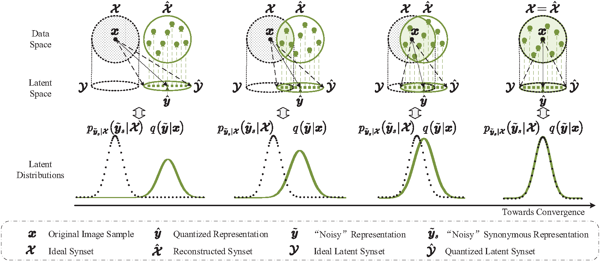

# Synonymous Variational Inference for Perceptual Image Compression

Implementation of ICML 2025 poster paper "**Synonymous Variational Inference for Perceptual Image Compression**".

Arxiv Link: [https://arxiv.org/abs/2505.22438](https://arxiv.org/abs/2505.22438)

The code is currently being organized and is expected to be uploaded, along with result data and visualizations, by the end of June 2025.

[Statement] Here, we first clarify that the main contribution of our paper is **to establish a unified mathematical theory for perceptual image compression, supporting existing RDP theory, and suggesting potential future research directions**. Our current rough implementation serves as a **preliminary validation**, demonstrating that a single model can adapt to multiple rates while approaching the performance of existing RDP methods, which aligns with our intended verification. **Achieving further performance breakthroughs will require future research efforts.**

> **An illustration of the optimization directions of synonymous image compression.**

## TL;DR:

This paper attempts to establish a unified theoretical framework for perceptual image compression in a synonymous relationship-based semantic information theory viewpoint.

## Abstract

Recent contributions of semantic information theory reveal the set-element relationship between semantic and syntactic information, represented as synonymous relationships. In this paper, we propose a synonymous variational inference (SVI) method based on this synonymity viewpoint to re-analyze the perceptual image compression problem. It takes perceptual similarity as a typical synonymous criterion to build an ideal synonymous set (Synset), and approximate the posterior of its latent synonymous representation with a parametric density by minimizing a partial semantic KL divergence. This analysis theoretically proves that the optimization direction of perception image compression follows a triple tradeoff that can cover the existing rate-distortion-perception schemes. Additionally, we introduce synonymous image compression (SIC), a new image compression scheme that corresponds to the analytical process of SVI, and implement a progressive SIC codec to fully leverage the model’s capabilities. Experimental results demonstrate comparable rate-distortion-perception performance using a single progressive SIC codec, thus verifying the effectiveness of our proposed analysis method.

## Lay Summary

When we compress images to save space or share them, we hope to reduce the file size without harming how they look. While traditional image compression technologies focus on pixel accuracy, which unfortunately doesn’t always match human perception, some AI-driven methods have achieved better results in practice. We aim to explore the underlying theory behind these works.

We noticed that two or more images can be mathematically “synonymous” and belong to a “synonymous set (synset)” if they look alike to people, even if their pixel-level details differ. Building on this idea, we develop an analysis framework called Synonymous Variational Inference (SVI), using ideas of semantic information theory. It not only theoretically explains why the AI-driven compression’s three-way trade-off among compression rates, pixel distortions, and distribution divergence, but also points out future improvements. We put it into practice with a progressive codec, Synonymous Image Compression (SIC), that compresses images across diverse file sizes while keeping them visually faithful.

We state that our work not only supports perceptual image compression in theory, but also contributes to semantic information theory by linking the synonymy perspective to practical image coding problems, helping move toward a unified viewpoint of semantic information.

